# 📦 Release Workflow Guide

## 🚀 Quick Start

This project uses an automated release workflow. Here's how to create a new release:

### Step 1: Create a Release Branch

Create a branch with the format `release/x.y.z`:

```bash
# Example: Create a release for version 0.0.2
git checkout -b release/0.0.2
```

**Important:** The version number MUST follow semantic versioning (x.y.z format)

### Step 2: Push and Create PR

```bash
git push -u origin release/0.0.2
```

Then create a Pull Request to `main` branch on GitHub.

### Step 3: Automatic Version Update ✨

When you create the PR, our automation will:

1. ✅ Extract the version number from your branch name (`0.0.2`)
2. ✅ Update `package.json` with the new version
3. ✅ Create a changeset file for the release
4. ✅ Commit and push the changes back to your branch
5. ✅ Add a comment to the PR with details

You'll see a comment like this:

> 🚀 **Auto Version Update**
>
> Version has been automatically updated to `0.0.2` based on the branch name.
>
> ✅ Changes:
> - Updated `package.json` version
> - Created changeset for release
>
> Please review and merge when ready!

### Step 4: Review and Merge

1. Review the automated changes
2. Add any additional changes if needed
3. Merge the PR when ready

### Step 5: Automatic Publishing 🎉

Once merged to `main`, the `Release to NPM` workflow will:

1. Build the package
2. Publish to npm (if configured with `NPM_TOKEN`)
3. Create a GitHub release

## 📋 Workflow Files

- **`.github/workflows/release-pr.yml`** - Handles automatic versioning for release PRs
- **`.github/workflows/release.yml`** - Publishes to npm when changes are merged to main

## 🔧 Configuration

### Required GitHub Secrets

- `NPM_TOKEN` - Your npm authentication token for publishing

### Branch Naming Convention

- ✅ Valid: `release/0.0.1`, `release/1.2.3`, `release/10.0.0`
- ❌ Invalid: `release-0.0.1`, `release/v0.0.1`, `release/0.0.1-beta`

## 💡 Tips

1. **Version Format**: Always use `x.y.z` format (e.g., `0.0.2`, `1.0.0`)
2. **Branch Name**: Must start with `release/` followed by the version
3. **Automatic**: The version update is completely automatic - no manual editing needed!
4. **Re-run Safe**: If you push more changes, the workflow checks if version is already updated
5. **Clean History**: All automation commits are made by `github-actions[bot]`

## 🐛 Troubleshooting

### Version Not Updated?

Check that your branch name follows the exact format: `release/x.y.z`

### Permission Errors?

Ensure your repository has the correct permissions for GitHub Actions:
- Settings → Actions → General → Workflow permissions → "Read and write permissions"

### Changeset Not Created?

The workflow automatically creates a changeset. If you want to add more details, you can edit the changeset file in `.changeset/` directory.

## 📚 Example Release

```bash
# 1. Create release branch
git checkout -b release/0.0.2

# 2. Push branch
git push -u origin release/0.0.2

# 3. Create PR on GitHub
# → Automation updates version automatically ✨

# 4. Review and merge PR
# → Package is published to npm automatically 🎉
```

## 🎯 Summary

```mermaid
graph LR
    A[Create release/x.y.z branch] --> B[Create PR to main]
    B --> C[Auto update version]
    C --> D[Review & Merge PR]
    D --> E[Auto publish to npm]
    E --> F[🎉 Release Complete!]
```



That's it! Simple, elegant, and fully automated. 🚀
